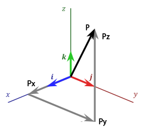

# 1.1 向量

## 1.1.1 定义
既有大小又有方向的量称为向量。

一个n维向量V可以表示为：

称为向量V的分量。对于三维向量P的分量，我们也可以使用座标轴表示为，和。

*G注：对于向量和点，既有相同也有不同，但是在使用和表述时，极易混淆。我们这里采用尖括号<>表示向量，采用圆括号()表示点。*

## 1.1.2 几何意义
向量可用带箭头的“有向线段”来表示。有向线段的起点和终点分别称为向量的起点和终点。

我们常见的有两种绘制方法：

- 向量，可以表示为一个以点A为起点，B为终点的有向线段。

- 对于三维向量P，一般选取原点 为起点，使用向量的三个分量，和做终点，进行绘制。

## 1.1.3 矩阵形式

### 1.1.3.1 定义
向量V也可以用一个单列矩阵表示：

为了便于书写，有时我们也采用矩阵的转置形式：

### 1.1.3.2 行向量与列向量
对于由一组数组成的向量，存在两种不同的矩阵形式，列向量（nx1矩阵,OpenGL采用）和行向量（1xn矩阵，D3D采用）。如无特殊说明，经典图形学著作中的向量V，全指列向量。对于行向量，则使用转置形式表示。

*G注：在行向量的使用上，微软纯粹“为了不一样而不一样”。而微软鼓吹的所谓，“行向量在矩阵变换时的乘法接近人类思维"，和"行向量在文字中书写方便"，实践证明没有多大用处。反而行向量的书写在矩阵推导上面占用空间过大，书写很是不便。*

## 1.1.4 自由向量与固定向量
向量分为自由向量和固定向量：

- 自由向量只确定于方向与大小，而不在意位置。数学中（也包括计算机图形学），常见的是自由向量。
- 固定向量确定于方向与大小，以及起点位置。力学中，多使用固定向量。

======================

 本作品采用<a rel="license" href="http://creativecommons.org/licenses/by-nc-sa/3.0/cn/">知识共享署名-非商业性使用-相同方式共享 3.0 中国大陆许可协议</a>进行许可。
