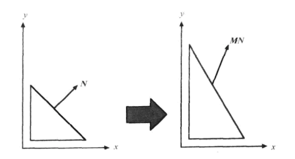

#3.5 法向量变换

##3.5.1 法向量变换的问题

在一个多边形模型中，含有大量的顶点向量数据。

同时，对于一个顶点数据，还有可能其他相关的数据。比如，切线向量（简称切向量）和法线向量（简称法向量）。

这些向量都是相关联的。我们在通过矩阵变换顶点向量的同时，也要相应的变换切向量和法向量。

对于非正交矩阵M，如果使用M来变换法向量，由于非正交矩阵不具备长度和角度不变性，所以无法保证变换后的法向量与切向量垂直！其情况如下图所示：

##3.5.2 法向量变换的方法

已知变换矩阵M，则法向量变换矩阵G可以表示为：

###3.5.2.1 法向量变换矩阵推导

已知：变换矩阵M，切向量T，法向量N
求：变换法向量N的变换矩阵G

解：

由T和N互相垂直，得：N·T=0 ①

设变换后的切向量，法向量，分别为：T',N'

则，有：T'=MT 

由T'和N'互相垂直，得：

N'·T'=(GN)·(MT)=0 

简单推导，得：

②

由①=②，并削去相同项得：

###3.5.2.2 法向量变换矩阵推论

由法向量变换矩阵可知，当M为正交矩阵时，G=M。这种情况，可以避免求逆转置矩阵的大量运算。

======================
 本作品采用<a rel="license" href="http://creativecommons.org/licenses/by-nc-sa/3.0/cn/">知识共享署名-非商业性使用-相同方式共享 3.0 中国大陆许可协议</a>进行许可。