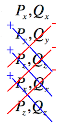
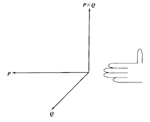
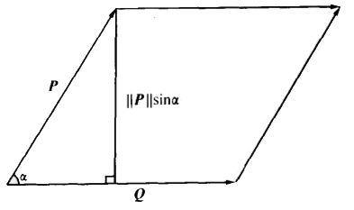

#1.7 向量积

##1.7.1 定义
向量积也叫外积，叉积。

求向量积的过程，称为叉乘。

两个n维向量P和Q的向量积记作P×Q。

##1.7.2 座标公式
两个3维向量P和Q的向量积的结果是一个向量，可以表示为：

###1.7.2.1 记忆方法

*G注：你可以能见过很多关于向量积公式的记忆方法，但是我对于他们都不甚满意，他们都太复杂了。下面这个是我独创的。如果你看到后面的矩阵部分的记忆方法的话，你会觉得他们很类似，一致性的东西总能提高我们的记忆力。*

首先，把P和Q的分量竖着写一遍，就像列向量那样，然后在末尾按照顺序多写两个，这样分量一共写了5行。

然后，打斜线，蓝色的是正，红色的是负。（注意，从y分量开始，或者这么记忆“计算向量积x分量时不用x分量”）

最后，从上到下，把每对斜线上的分量相加，就得到对应的分量。

##1.7.3 几何意义

在3维空间中，3维向量P和Q的向量积P×Q，表示为一个从这两个向量交叉点穿过的向量，并且垂直于这两个向量所确定的平面。

一共有两个向量满足这个，采用哪个，取决于我们使用的座标系。在OpenGL中，我们使用右手座标系，通过右手法则来确定该向量的方向。

##1.7.4 向量积的模
对于给定的两个3维向量P和Q，和他们的夹角α，他们的向量积P×Q的模可由下面的几何公式求出：

###1.7.4.1 向量积的模的公式推导

取|P×Q|的平方，可得：

右边加上并减去可得：

代入向量的数量积的几何公式（1.4.3），并由毕达哥拉斯三角恒等式（
）可得：

两边同时开方：

证毕！

###1.7.4.2 向量积的模的几何意义

给定的两个3维向量P和Q，向量积P×Q的模表示由P和Q围成的平行四边形的面积。

###1.7.4.3 推论
对于非零向量P与Q，P与Q平行的充要条件是：P×Q=0

##1.7.5 性质

向量积有一些有趣的性质：

1. 向量积的负交换律：P×Q=-(Q×P)
2. (aP)×Q=P×(aQ)=a(P×Q)
3. 向量积对向量加法的分配率：P×(Q+R)=P×Q+P×R;(P+Q)×R=P×R+Q×R
4. P×P=0=<0,0,0>

======================
 本作品采用<a rel="license" href="http://creativecommons.org/licenses/by-nc-sa/3.0/cn/">知识共享署名-非商业性使用-相同方式共享 3.0 中国大陆许可协议</a>进行许可。
