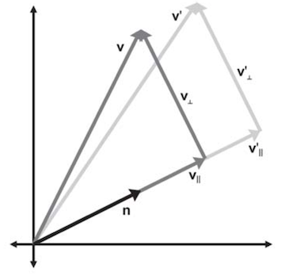

#3.2 缩放变换

##3.2.1 缩放矩阵

缩放变换是最简单的一类变换。缩放变换由缩放矩阵来完成，我们记作。其中，分别表示，沿x，y，z轴的缩放系数。

###3.2.1.1 推导 

已知当前有一组标准正交基，P=\<1,0,0\>,Q=\<0,1,0\>,R=\<0,0,1\>。那么经过缩放后的正交基为：

构造缩放变换矩阵可得：

###3.2.1.2 统一缩放与非统一缩放

在3.2.1.1中，当相等时，称为统一缩放。具体表现为，物体沿某一比例，等比例增大。

反之，称为不统一缩放。具体表现为，物体在某一座标轴方向上沿某一比例增大。

##3.2.2 沿任意轴进行非统一缩放

解决这个问题有两种思路，一种是通过矩阵组合方式，一种是推导公式。

###3.2.2.1 矩阵组合法的推导

已知：轴向量U，V，W；系数a，b，c；向量P。
求：沿轴向量U，V，W，分别按系数a，b，c缩放向量P的矩阵组合。

根据2.7节，可构造从当前座标轴向轴向量U，V，W所建立的座标系的矩阵R。

因为我们要在当前座标轴上进行缩放，所以需要是R的逆矩阵将轴向量旋转至与当前座标轴基向量重合。

然后使用非统一缩放矩阵进行缩放。

最后再使用矩阵R旋转回去即可。

计算过程如下：

这种写法结构清晰，但是运行速度较慢。

###3.2.2.2 沿任意轴非统一缩放公式的推导

另一种方式是直接推导公式：

已知：向量V，轴向量N，系数k
求：沿轴向量N，按系数k，缩放V后得到的新向量V'的变换矩阵。

解：

根据向量投影定理，有：

∵V⊥垂直于N

∴不被缩放影响，有：

①

而

②

③

设基向量P=<1,0,0>,Q=<0,1,0>,R=<0,0,1>

那么，只需要代入③，即可得到变换后的基向量P',Q',R'。

同理可得：

综上，由P',Q',R'基向量构造变换矩阵

======================
 本作品采用<a rel="license" href="http://creativecommons.org/licenses/by-nc-sa/3.0/cn/">知识共享署名-非商业性使用-相同方式共享 3.0 中国大陆许可协议</a>进行许可。